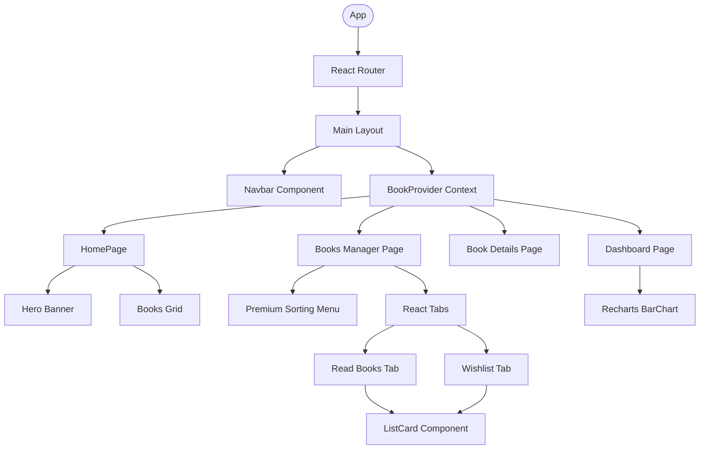

# 📚 Book Vibe - Premium Book Tracker & Visualization App

Welcome to **Book Vibe**, a premium, state-of-the-art Single Page Application (SPA) designed for book enthusiasts to discover, organize, sort, and visually track their reading habits. Built using **React**, **Vite**, **Tailwind CSS**, and **Recharts**, Book Vibe delivers a stunning user experience with seamless performance, global state management, persistent storage, and dynamic charts.

---

## 🚀 Key Features

*   **✨ Interactive Homepage & Hero:** Includes an elegant welcoming banner with a curated grid of available books featuring tags, categories, authors, and ratings.
*   **📖 Detailed Book Inspecting (`BookById`):** Dive deep into book metadata (synopsis, review, author, year of publishing, publisher, tags, and page counts) with direct actions to mark as read or add to a wishlist.
*   **💾 Persistent Multi-List Storage:** Dynamically tracks separate **Read List** and **Wishlist** books across sessions using a robust custom local database system synced with `localStorage`.
*   **🔀 Intelligent Double-Adding Prevention:** Smart logic ensures you cannot add a book to the wishlist if it's already in your read list, with instant visual warnings.
*   **📊 Dynamic Data Visualization:** High-performance analytical dashboard displaying custom-designed geometric bar charts of pages read per book using custom Recharts.
*   **⚡ Premium Multi-Criteria Sorting:** Sort your curated read/wish lists on-the-fly by **Rating**, **Page Count**, or **Year of Publishing** in descending order.
*   **🔔 Elegant Interactive Toasts:** Powered by `react-toastify` to give instant, harmonized notifications for successful operations or warnings.

---

## 🛠️ Tech Stack & Library Integrations

*   **Core:** React 18+ & Vite (Ultra-fast Hot Module Replacement)
*   **Styling & UI:** Tailwind CSS, DaisyUI, Glassmorphism, and Vanilla CSS
*   **Routing:** React Router v6 (Nested Routing, Dynamic Route Loaders, Custom Error Boundary Pages)
*   **Charts:** Recharts (Dynamic custom SVG shapes and customized color labels)
*   **Tabs:** React Tabs (Highly-responsive tab-switching for lists)
*   **Feedback:** React Toastify (Premium real-time micro-animation alerts)

---

## 📊 Architectural Flows & Diagrams

### 1. Application Component Structure



### 2. State & localStorage Synchronization Flow

```mermaid
sequenceDiagram
    autonumber
    actor User
    participant Details as "BookDetails Page"
    participant Context as "BookProvider (React Context)"
    participant LocalDB as "localDB Utility"
    participant LocalStorage as "Browser LocalStorage"

    User->>Details: Click 'Mark as Read'
    Details->>Context: Check if book is already in readList
    alt Already exists
        Context-->>User: Toast Warning: Already read!
    else New Book
        Details->>Context: Update readList state
        Details->>LocalDB: Call addToLocalDB(book)
        LocalDB->>LocalStorage: Save stringified book array
        Details-->>User: Toast Success: Added to read list!
    end
```

---

## 🎣 React Hooks Used

The application leverages a rich array of core and third-party React hooks to achieve its robust reactivity:

1.  **`useContext`:** Used to consume `bookContext` throughout the application, sharing the active `readList` and `wishList` across pages (Details, List Tabs, and Dashboard Charts) without prop-drilling.
2.  **`useState`:** Manages component-level interactive state:
    *   `sortingType` in the `Books` listing page to compute sorted arrays.
    *   Global state values initialized lazily via helper functions.
3.  **`useEffect`:** Handles secondary side effects, such as initial database synchronization on mount to guarantee up-to-date localStorage states.
4.  **`useLoaderData` (React Router):** Fetches individual book details asynchronously during route transitions using optimized loaders, removing the need for loading screens or empty states.
5.  **`useParams` (React Router):** Resolves dynamic parameters for finding and viewing detailed information on specific books.

---

## 📁 Directory Structure

```text
Book-Vibe/
├── public/                 # Static assets & dynamic redirects configuration
│   ├── booksData.json      # Curated mock book database
│   └── _redirects          # Single Page Application routing config for deployment
├── src/
│   ├── MainLayOut/         # Global layout wrappers
│   │   └── MainLayOut.jsx
│   ├── pages/
│   │   ├── HomePage/       # Welcoming page (Hero + Grid list)
│   │   ├── Books/          # Tabs for Read/Wish lists + Sorting Dropdown
│   │   ├── PagesRead/      # Recharts Analytical Dashboard
│   │   └── ErrorPage/      # Custom 404 & dynamic crash handlers
│   ├── utils/
│   │   └── localDB.js      # Robust localStorage middleware & parsers
│   ├── context.jsx         # Global state Provider setup
│   ├── BookById.jsx        # Inspecting and action page
│   ├── index.css           # Styling directives
│   ├── main.jsx            # React root renderer
│   └── Routes/             # Router declarations and dynamic loaders
├── tailwind.config.js      # Custom theme setup
├── vite.config.js          # Hot-reloading options
└── package.json            # Scripts & libraries declarations
```

---

## ⚙️ Installation & Local Setup

Get the project running on your local machine in seconds:

1.  **Clone the repository:**
    ```bash
    git clone https://github.com/your-username/book-vibe.git
    cd book-vibe
    ```

2.  **Install dependencies:**
    ```bash
    npm install
    ```

3.  **Run in development mode:**
    ```bash
    npm run dev
    ```

4.  **Build for production:**
    ```bash
    npm run build
    ```

---

## ✨ Developed with visual excellence, responsive design, and robust React architectures. Enjoy tracking your reading vibe!
# Premium-Book-Tracker-Visualization-App-React-
